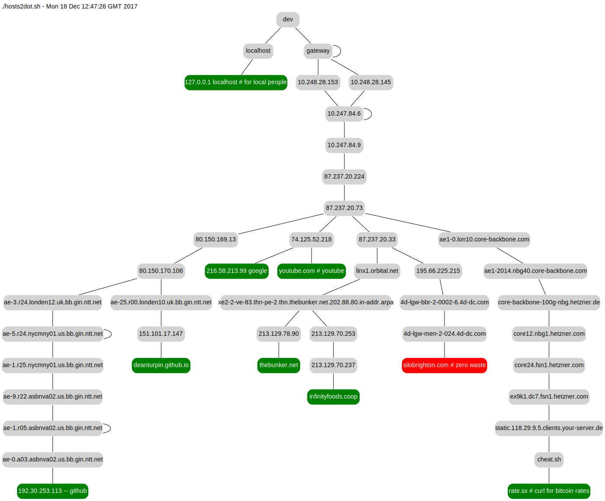

Download the source on [GitHub](https://github.com/deanturpin/hosts2dot).

The script takes a hosts file on stdin and generates a dot format
network topology of all the IPs encountered on the way. The dot renderer is then
run by ```make``` to create the SVG.
```bash
$ make
```

View the SVG in a web browser
```bash
$ firefox topology.svg
```



Test it with a single host using the triple chevron syntax.
```bash
$ ./hosts2dot.sh <<< github.com
```

# Hosts file format
You can use a standard system hosts file but the script actually only cares
about the first host or IP on a line; the whole line is used to name the leaf
node. In fact, any file format may be used as long as each line begins with
something that can be pinged.

```
127.0.0.1 localhost # for local people
216.58.213.99 - google
```

At work I run it as a Jenkins nightly and the hosts file is a list of things I'm
interested in on the company Intranet.
