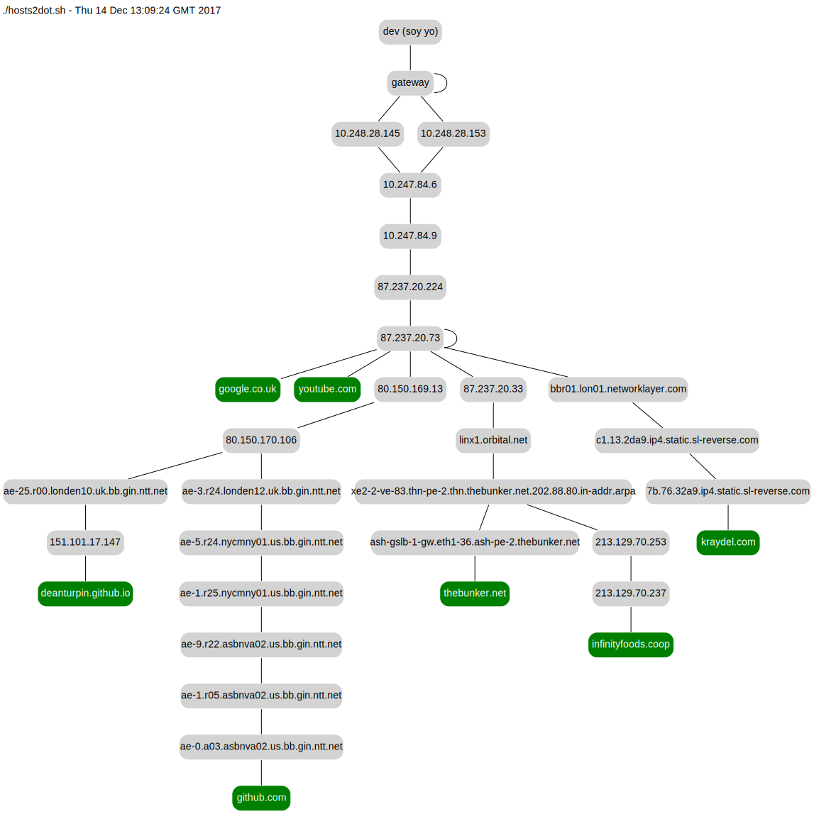

The script takes a list of hosts on the command line and generates a dot format
network topology of all the IPs encountered on the way. The dot renderer is then
run by ```make``` to create the SVG. For convenience I've listed the hosts in a
separate text file [hosts.txt](hosts.txt) which ```make``` expands. And rather
than running it manually I include it in a Jenkins nightly having updated the
hosts file with interesting IPs on my company Intranet.

```bash
$ ./hosts2dot.sh github.com silobrighton.com
```
Render SVG with ```make```
```bash
$ make clean
$ make
```
View the SVG in a web browser
```bash

$ firefox example.svg
```

