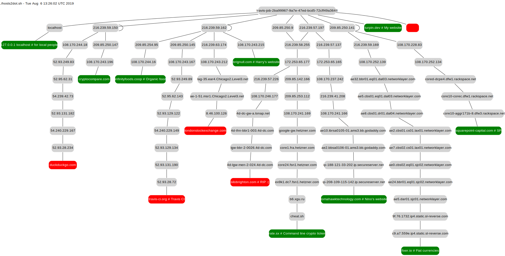

The script takes a hosts file on stdin and generates a dot format
network topology of all the IPs encountered on the way. The dot renderer is then
run by ```make``` to create the SVG.
```bash
$ make clean
$ make
```

View the SVG in a web browser
```bash
$ firefox topology.svg
```



Test it with a single host using the triple chevron syntax.
```bash
$ ./hosts2dot.sh <<< github.com
```

## Hosts file
You can use a standard system hosts file but the script only extracts the host
or IP before the first space. The whole line is used to name each leaf node. In
fact any format can be used as long as each line begins with something that can
be pinged.

```
127.0.0.1 localhost # for local people
216.58.213.99 - google
```
